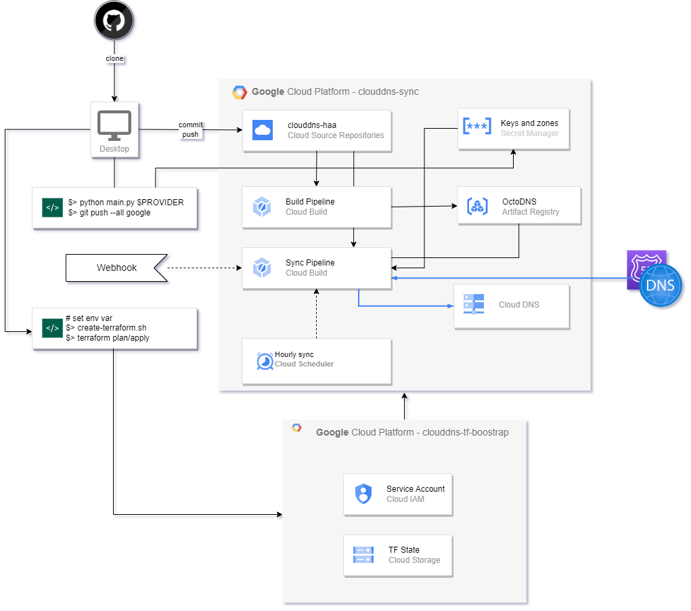

# Google Cloud DNS in Multi Cloud High Availability Implementation

This project will help you provision a Google Cloud environment with Cloud DNS and all required resources to easily replicate domain zones from your current provider to Cloud DNS. It also has optional features to perform a periodic one-way synchronization from your current provider to Cloud DNS. It was meant for 3 use cases:
- Migrate to Google Cloud
- Configure Google Cloud DNS as a backup strategy
- Configure an highly available multi cloud DNS authority using two cloud providers

## Content

- [Google Cloud DNS in Multi Cloud High Availability Implementation](#google-cloud-dns-in-multi-cloud-high-availability-implementation)
  - [Content](#content)
  - [Solution](#solution)
    - [Execution Flow](#execution-flow)
    - [Directory structure and files](#directory-structure-and-files)
  - [Prerequisites](#prerequisites)
  - [Step-by-step Guide](#step-by-step-guide)
    - [Using Google Cloud Shell](#using-google-cloud-shell)
    - [Using Your Computer](#using-your-computer)
  - [Optional Features](#optional-features)
  - [Supported Providers](#supported-providers)
  - [General Notes and References](#general-notes-and-references)

## Solution

The solution implemented by this repository consists of 2 GCP projects:
- **Terraform Bootstrap**: Minimal recommended terraform requirements for running terraform:
  - A service account with the required permissions
  - A storage bucket to save terraform state
- **CloudDNS HHA**: Cloud DNS environment with all resources for the solution:
  - A Cloud Source Repository to store this repository on your own environment
  - A Secret Manager to store required secrets
  - A Cloud Build environment with 3 pipelines:
    - Build OctoDNS image
    - Cloud Build Trigger for Sync Plan
    - Cloud Build Trigger for Sync Apply
  - Artifact Registry
  - Cloud Scheduler (Optional)

Bellow a diagram for better understanding:



### Execution Flow

This is an overview of how the process of putting the solution up and running works. There is this [Step by Step guide](#step-by-step-guide) which will help you to configure and deploy the whole solution.

1. Obtain the source code:
   - Clone the repo in your machine or cloud shell.
1. Setup environment variables necessary to use the included `python` and `shell` scripts for:
   -  creating the `clouddns-tf-bootstrap` project;
   -  creating the `clouddns-sync` project `OR` using an existing project you may have:
      - By using the `.env.example` file, creates the `.env` file and set the necessary values accordingly;
      - Invoke the `./tools/create-terraform.sh` script to create the `clouddns-tf-bootstrap` GCP project. This project is responsible for:
        - Housing the necessary [Service Account](https://cloud.google.com/iam/docs/service-account-overview) with all permissions to execute the terraform in order to provision the `clouddns-sync` project and all of its resources;
        - Creating a [GCP Storage Bucket](https://cloud.google.com/storage/docs) in the `clouddns-tf-bootstrap` project for storing the `TF State` as the [terraform backend configuration](https://developer.hashicorp.com/terraform/language/settings/backends/configuration) for the `clouddns-sync` project.
1. By impersonating the service account created in the previous step, you will generate the whole necessary resources for the solution by using `terraform plan` and `terraform apply` in one of the following options:
   - `clouddns-sync`: this is a automatically generated project in case you want to provision all resources from scratch, including the project;
   - `existing-project`: this is a project you have access so all resources will be provisioned in there.    

   The generated `tf plan` will be kept in the bucket you generated in the previous step. Here are the resources created:
   
   - `clouddns-haa`: this is the source repository to hold the `clouddns-haa` code in your own infra;
   - `Build Pipeline`: this is the cloud build pipeline to create the `clouddns-haa` based image of `OctoDNS` and kept in gcp artifact registry;
   - `OctoDNS`: this is the artifact registry where the previous generated image is held for later execution usages;
   - `Sync Pipeline`: this is the cloud build pipelines created for manual, scheduled or webhook invocations for synchronizing the DNS zones. The image generated by previous steps will be used here to invoke the `OctoDNS` to sync up the DNS regions from the provider to GCP Cloud DNS.
   - `Cloud DNS`: this is the [Cloud DNS](https://cloud.google.com/dns/docs) where the desired DNS zones from the selected providers will be re-created in GCP when the `Sync Pipelines` are triggered.
   - `Keys and Zones`: these are the keys kept in the secret manager for holding several values such as provider's credentials and zones to be migrated. These keys are used by the `Sync Pipeline` mainly to get access to the selected provider.
   - `Hourly sync`: this is the cloud scheduler to periodically synchronize the DNS zones from the provider to GCP.
1. The user invokes the `python.main` script and it will generated few things:
   - The provider's credentials keys stored in secret manager to be used by the `Sync Pipeline`;
   - The specific zones keys stored in secret managet to be re-created from the provider to gcp;
   - Two files: `clouddns-haa-plan.json` and `clouddns-haa-apply.json`. These files are the build template steps for executing the synchronizating for the DNS zones from the provider to gcp. The build template steps are used by the `Sync Pipeline` once they are triggered.
1. The user pushes the `clouddns-haa-plan.json` and `clouddns-haa-apply.json` files generated in the previous step to `clouddns-haa` cloud source repositories.
1. The `Sync Pipeline` is triggered in one of the following methods you choose during the deployment:
   - Manual;
   - Webhook;
   - Scheduled.

### Directory structure and files

   Once you clone this repo you may find useful to look what are the main detailed content in its directories and files:

  - `./build`: it contains the `Dockerfile` which defines the necessary steps to create the `octodns` docker image.
  - `./tools`: it contains the shell script `create-terraform.sh` which creates a GCP project used for housing the terraform service account and bucket to store the terraform state file for the solution, which is generated in another project.
      - Creates the project;
      - Enables all necessary APIs;
      - Creates the bucket to store the terraform state file of the solution;
      - Creates the Service Account used by terraform to provision the infra;
      - Grants all the necessary permissions to the Service Account.
  - `./terraform`: it contains the terraform code for provisioning all GCP resources. The content of this directory is organized between modules and executions as follow:
      - `./terraform/executions/cloudns-haa`: it contains the setup for provisioning the resources in case you want to reuse an existing project:
        - `backend.tf`: defines the bucket where the `tf State` of the provisioned resources by terraform will be stored;
        - `main.tf`: defines the call to `clouddns-haa` module;
        - `variables.tf`: these are the input variables to run the terraform and provision all resources. The values of these variables are defined in the `.env` file as explained later on this [GUIDE](GUIDE.md#define-environment-variables). Note that these variables contain the prefix `TF_VAR_` followed by its name;
        - `outputs.tf`: these are the exported variables containing specific values of resources once the terraform is applied.
      - `./terraform/executions/clouddns-haa-standalone`: it contains the setup for provisioning all resources from scratch, including a new project:  
        - `backend.tf`: defines the bucket where the `tf State` of the provisioned resources by terraform will be stored;
        - `main.tf`: defines the call to `clouddns-haa-base-project` and `clouddns-haa` modules;
        - `variables.tf`: these are the input variables to run the terraform and provision all resources. The values of these variables are defined in the `.env` file as explained later on this [GUIDE](GUIDE.md#define-environment-variables). Note that these variables contain the prefix `TF_VAR_` followed by its name;
        - `outputs.tf`: these are the exported variables containing specific values of resources once the terraform is applied.
      -`./terraform/modules/clouddns-haa`: it contains the code to provision all necessary resources to run the solution:
        - `cloud-scheduler.tf`: creates the [Google Cloud Scheduler](https://cloud.google.com/scheduler/docs) for periodic synchronization.
          __NOTE__: it will only be available if you choose the manual trigger event because [webhook triggers cannot be scheduled](https://cloud.google.com/build/docs/schedule-builds#:~:text=You%20can%20only%20schedule%20builds%20if%20your%20trigger%20is%20a%20manual%20trigger.)
        - `cloudbuild-img.tf`: creates the [Google Cloud Build](https://cloud.google.com/build/docs) trigger to start the pipeline for building the docker image of `octodns` defined in `./build/Dockerfile`. Note that this code is retrieved from the `clouddns-haa-repo` cloud source repository.
        - `cloudbuild-sa.tf`: assign the necessary roles to the default cloud build service accounts created by GCP once the cloud build api is enabled. These roles are necessary to give the permissions to the cloud build to be able to change the DNS.
        - `cloudbuild-triggers.tf`: creates both [Google Cloud Build](https://cloud.google.com/build/docs) triggers for planning and applying the DNS synchronization from the desired provider to GCP. The [build template steps](https://cloud.google.com/build/docs/configuring-builds/configure-build-step-order) for them are dynamically generated and pushed to the `clouddns-haa-repo` cloud source repository as explained later on this [GUIDE](GUIDE.md#create-secrets-and-pipeline-files). Basically the generated build steps consists in:
          - Build `OctoDNS` config by calling the `config.py` script which generates the `config.yaml` file used by `octodns`;
          - Call `octodns` passing the generated `config.yaml` to it for either plan or apply commands. The `octodns` is a container built from an docker image which is stored in `clouddns-haa-artifact-repo`.
        
          These triggers might have their events set to `manual` or `webhook`, depending on what you choose while setting the `.env` file as explained later on this [GUIDE](GUIDE.md#define-environment-variables):
          - `manual`: this is the default configuration and explicitly needs to run the triggers manually, via cloud console for example;
          - `webhook`: you use this configuration when you want the triggers to be called by using a webhook, from an integrated pipeline for example.
        - `iam.tf`: assign the necessary roles to the user and the Cloud Scheduler service account to interact with the necessary resources in GCP involved in the solution at project level.
        - `repos.tf`: creates the following repository with their responsibilities:
          - `clouddns-haa-repo`: [Cloud Source Repository](https://cloud.google.com/source-repositories/docs) to store this code. Once this is stored in cloud source respository, Cloud Build will interact with it;
          - `clouddns-haa-artifact-repo`: [Artifact Registry](https://cloud.google.com/artifact-registry/docs) to store the `octodns` docker image necessary to plan and apply the synchronization of domain zones to GCP Cloud DNS.
        - `secrets.tf`: defines the necessary secret in [Secret Manager](https://cloud.google.com/secret-manager/docs) used by `webhook` triggers. When calling webhook triggers the secret key is required in the URL.
        - `variables.tf`: these are the input variables to run the terraform and provision all resources. The values of these variables are defined in the `.env` file as explained later on this [GUIDE](GUIDE.md#define-environment-variables). Note that these variables contain the prefix `TF_VAR_` followed by its name.
        - `outputs.tf`: these are the exported variables containing specific values of resources once the terraform is applied.
      - `./terraform/modules/clouddns-haa-base-project`: it contains the code to provision a project from scratch to house all the necessary resources for the solution:
        - `dns-project.tf`: creates the project and enables the necessary APIs for housing the whole sync solution under the specified organization and folder. This is the project where the domain zones will be replicated from your provider to GCP Cloud DNS.
        - `variables.tf`: these are the input variables to run the terraform and provision all resources. The values of these variables are defined in the `.env` file as explained later on this [GUIDE](GUIDE.md#define-environment-variables). Note that these variables contain the prefix `TF_VAR_` followed by its name.
        - `outputs.tf`: these are the exported variables containing specific values of resources once the terraform is applied. 
  - `.env.example`: template file which contains all necessary environment variables for setting up the execution and deploying the solution.
  - `main.py`: contains the handler for creating the secrets and storing them in [Secret Manager](https://cloud.google.com/secret-manager/docs) as well as generating the [build template steps](https://cloud.google.com/build/docs/configuring-builds/configure-build-step-order) according to the provider. These steps are necessary to `plan` and `apply` commands for the DNS synchronization from the provider to GCP and are executed by [Google Cloud Build](https://cloud.google.com/build/docs) triggers. 
  - `config.py`: contains the handler for checking the `zones` which will be synchronized and generates the `config.yaml` according to the provider. This file is used by `OctoDNS`. The `config.yaml` basically contains the necessary information to make it possible `OctoDNS` synchronizing the dns zones from the desired provider to GCP.    
  - `gcp.py`: contains the specific methods for manipulating the secrets in `gcp secret manager`.
  - `aws.py`: specific to `route53` provider. It contains the specific methods used by the handlers to create the `build template steps` and `config.yaml` files to be used by `cloud build triggers` and `octoDNS` to synchronize the zones. 
  - `az.py`: specific to `azure` provider. It contains the specific methods used by the handlers to create the `build template steps` and `config.yaml` files to be used by `cloud build triggers` and `octoDNS` to synchronize the zones.

<!-- ### Use Cases

#### Migration
#### Active/Passive
#### Active/Active -->

## Prerequisites

To be able to deploy this solution you will need:

* A folder to create projects in
* Permissions (more details bellow)
* Google Cloud CLI
* Git 2.25 or earlier
* Terraform 1.3 or earlier
* Python 3 or earlier
* Python Pip and Venv

## Step-by-step Guide

This guide will walk you through all the steps for provisioning and executing the solution.

**Tips:** We recommend using [Google Cloud Shell](https://cloud.google.com/shell), as all  required tools for deploying this solution are already installed and configured, including required authentication.

<!-- ! in development only -->
 :bangbang::red_circle:**While in Development**:red_circle::bangbang:
<details>
  <summary>While in Development Only</summary>

For now, as this is a private github repository, to clone this repository, you will need a **SSH key** or **Github Personal Access Token**

To use this button you will need to have already authenticated your Cloud Shell git with a **Github Personal Access Token**

So, if you have be already authenticated, just click it, or expand the section  **Configuring Git/Github authentication** for instructions

<details>
  <summary>Configuring Git/Github authentication</summary><br>

1. Configure your git on cloud shell to store credentials

    > Cached
    ``` bash
    git config --global credential.helper cache
    # configure for how long
    git config --global credential.helper 'cache --timeout=600'
    ```

    > Stored

    ``` bash
    git config --global credential.helper store
    ```

  2. Generate a Developer Personal Access Token at [**Settings > Developer Settings > Personal Access Tokens**](https://github.com/settings/tokens)
  
      2.1 Left side, choose Tokens (Classic)

      2.2 Insert a Name, expiration date

      2.3 select 'Repo' and click 'Generate Token'

  3. Copy the token 
  4. Manually clone any private repository, and input your username and password (Classic Token) that you have access

      ``` bash
      git clone https://github.com/cit-gcd/clouddns-haa.git
      ```
  
      **Tips**: if you have cloned this repository, you may continue from there

      ```bash
      cd clouddns-haa
      teachme GUIDE.md
      ```
</details><br>

</details><br>

 :bangbang::red_circle:**While in Development**:red_circle::bangbang:
<!-- ! in development only -->

### Using Google Cloud Shell

One way is by using [Cloud Shell](https://console.cloud.google.com/?cloudshell=true), and following the [GUIDE](GUIDE.md).

If you prefer, you could use the **Cloud Shell Tutorial** by clicking on the button below, where you will have the [GUIDE](GUIDE.md) in a step-by-step tutorial mode.

[](https://console.cloud.google.com/cloudshell/open?git_repo=https://github.com/cit-gcd/clouddns-haa.git&page=editor&tutorial=GUIDE.md)

### Using Your Computer

1. First, make sure you are authenticated:

```sh
gcloud auth login
```
  
2. Use the credentials to authenticate to the Google Cloud APIs

```sh
gcloud auth application-default login
```

**WARNING**: you may receive a warning about a quota project. It will not be required, yet if you don't want to receive other warnings, you may run the command bellow:

To use the above command, you will need to use an existing project where you have `serviceusage.use` permission and this project must have `cloudresourcemanager.googleapis.com` api enabled.

```sh
gcloud auth application-default set-quota-project <project>
```

3. After these first steps, just follow the [GUIDE](GUIDE.md)

  <!-- If you prefer to use your own local machine, you can open your terminal and follow the [GUIDE](GUIDE.md) -->
</details>

## Optional Features

There are some optional features for this solution, which are:
- Webhooks for integration
  - Allows triggering the planning and apply trigger via webhooks
- Scheduler
  - Configure scheduled periodic synchronization
- Manually provide a list of zones to be synchronized
  - Create a zones.txt file with a list of selected zones to be synchronized

## Supported Providers

Currently, AWS Route 53 and Microsoft Azure DNS are supported

## General Notes and References

- [General Notes](NOTES.md)
- [Terraform Variables Details](terraform/README.md)
- [Guide](GUIDE.md)
- [Cloud DNS](https://cloud.google.com/dns)
- [Octo DNS](https://github.com/octodns/octodns)
